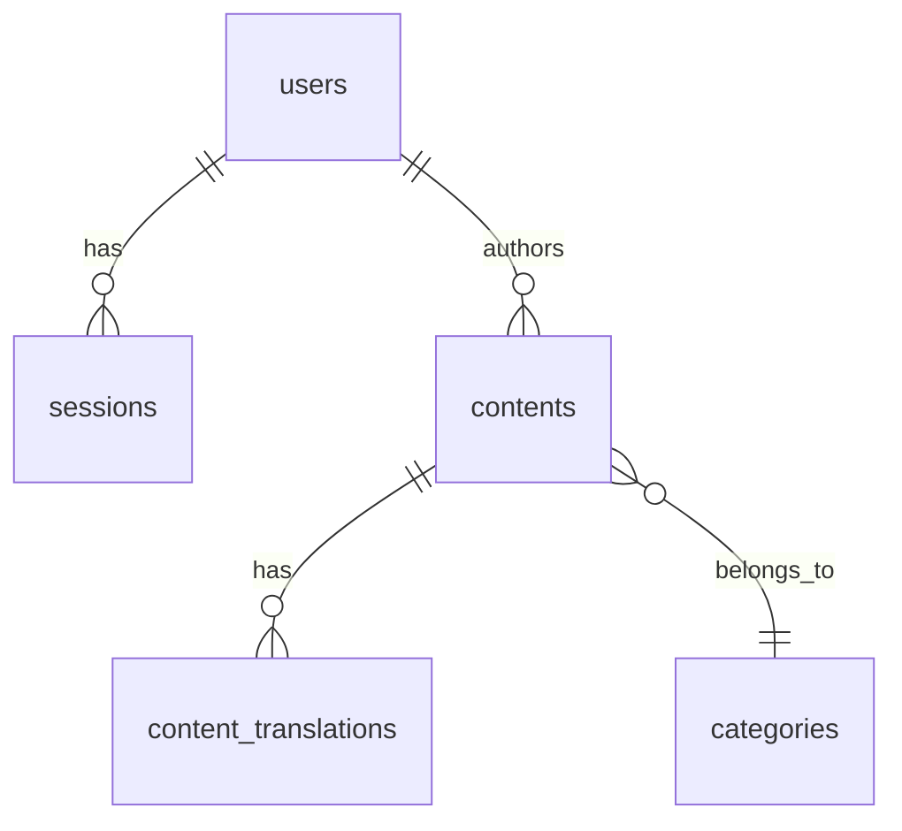

# アーキテクチャ設計書

## システム全体像

```
                    ┌──────────────────────────────────────────────┐
                    │             Cloudflare Edge Network          │
                    │                                              │
  Client ──────▶   │  ┌─────────────────┐   ┌──────────────┐     │
  (Browser)        │  │  Cloudflare      │   │  Pages       │     │
                    │  │  Pages           │──▶│  Functions   │     │
                    │  │  (Static Files)  │   │  (Workers)   │     │
                    │  └─────────────────┘   └──────┬───────┘     │
                    │                               │              │
                    │                    ┌──────────┼──────────┐   │
                    │                    ▼          ▼          ▼   │
                    │              ┌────────┐ ┌────────┐ ┌──────┐ │
                    │              │  D1    │ │  R2    │ │ KV   │ │
                    │              │ (SQL)  │ │(Blob)  │ │(opt) │ │
                    │              └────────┘ └────────┘ └──────┘ │
                    └──────────────────────────────────────────────┘
                                        │
                         ┌──────────────┼──────────────┐
                         ▼              ▼              ▼
                    ┌─────────┐   ┌──────────┐   ┌──────────┐
                    │ Gemini  │   │ LINE API │   │ Resend   │
                    │ API     │   │          │   │ (Email)  │
                    └─────────┘   └──────────┘   └──────────┘
```

## API エンドポイント一覧

### パブリック API（認証不要）

| メソッド | パス | 説明 |
|---|---|---|
| GET | `/api/frontend` | コンテンツ取得（l1/l2/q/all/mode パラメータ対応） |
| GET | `/api/frontend/sourapple_news` | Sourapple ニュース取得 |
| GET | `/assets/**` | R2バケットからの静的アセット配信 |
| POST | `/api/contact` | お問い合わせ送信 |
| POST | `/api/sourapple_contact` | Sourapple お問い合わせ |

### 認証 API

| メソッド | パス | 説明 |
|---|---|---|
| POST | `/api/auth/login` | メール/パスワードログイン |
| POST | `/api/auth/register` | 新規ユーザー登録 |
| POST | `/api/auth/verify` | メール認証 |
| GET | `/api/auth/me` | 現在のユーザー情報取得 |
| POST | `/api/auth/logout` | ログアウト |
| GET | `/api/auth/google` | Google OAuth 開始 |
| GET | `/api/auth/google/callback` | Google OAuth コールバック |
| GET | `/api/auth/line` | LINE Login 開始 |
| GET | `/api/auth/line/callback` | LINE Login コールバック |
| POST | `/api/auth/set_cookie` | セッショントークン設定 |

### 管理 API（認証必須）

| メソッド | パス | 説明 | 権限 |
|---|---|---|---|
| GET | `/api/posts` | 投稿一覧（権限スコープ付き） | contributor+ |
| GET/POST | `/api/content/[id]` | コンテンツ CRUD | editor+ |
| POST | `/api/content/import` | Excel/CSVインポート | editor+ |
| GET/POST | `/api/categories` | カテゴリ管理 | editor+ |
| GET/POST/DELETE | `/api/keywords` | SEOキーワード管理 | editor+ |
| GET/POST/DELETE | `/api/knowledge` | ナレッジベース管理 | editor+ |
| GET/POST | `/api/users` | ユーザー管理 | admin |
| GET/POST | `/api/media` | R2メディアアップロード | editor+ |
| POST | `/api/media/move` | R2メディア移動 | editor+ |
| POST | `/api/generate` | AI記事生成 | editor+ |
| POST | `/api/translate` | AI翻訳 | editor+ |
| POST | `/api/publish` | コンテンツ公開制御 | editor+ |
| POST | `/api/broadcast` | LINE/Email一斉配信 | admin |
| GET | `/api/broadcast_preview` | 配信プレビュー | admin |
| GET/POST | `/api/seo` | SEO設定管理 | editor+ |
| GET | `/api/inquiries` | お問い合わせ一覧 | editor+ |
| PUT | `/api/inquiries/status` | お問い合わせステータス更新 | editor+ |
| GET | `/api/apples` | りんご品種一覧 | - |
| GET | `/api/webhook/ig` | Instagram Webhook | - |

### Cron API

| メソッド | パス | 説明 |
|---|---|---|
| GET | `/api/cron/broadcast` | 予約配信の定期実行（GitHub Actions経由） |

## データベーススキーマ

### テーブル構成

```
users                 # ユーザー（管理者・編集者・投稿者）
├── sessions          # セッション管理
│
contents              # メインコンテンツ（記事・店舗・イベント等）
├── content_translations  # 多言語翻訳データ
│
categories            # カテゴリマスタ（l1/l2/l3 × 3言語）
seo_keywords          # SEOキーワードマスタ
knowledge_base        # ナレッジベース（AI記事生成用）
apple_varieties       # りんご品種マスタ
seo_settings          # ページ別SEO設定
form_submissions      # フォーム送信データ
broadcast_history     # 配信履歴
```

### ER図（概要）



## 認証フロー

### JWT セッション管理

```
1. ユーザーがログイン（メール/パスワード or OAuth）
2. サーバーが JWT トークンを生成（HS256）
3. admin_session_token Cookie にセット（HttpOnly）
4. 以降のリクエストで Cookie から JWT を検証
5. ペイロードにユーザーID、role、managed_sites を含む
```

### 権限モデル

| Role | 説明 | スコープ |
|---|---|---|
| `admin` | 全権限 | 全サイト |
| `editor` | コンテンツ編集・公開 | managed_sites で制御 |
| `contributor` | 自分の投稿のみ | 自分のコンテンツのみ |

## ミドルウェア

### SEO HTMLRewriter (`_middleware.js`)

- HTMLレスポンスのみをインターセプト
- `seo_settings` テーブルからページパスに対応するSEO情報を取得
- `<title>`, `<meta>`, `<link>` タグをリアルタイムで書き換え
- DB にエントリがない場合はHTMLをそのまま返す

## メディア管理

- アップロードは R2 バケット (`portal-uploads`) に保存
- `/assets/**` パスで R2 からプロキシ配信
- パスのエンコーディング対策（日本語ファイル名対応）
- 1年間のキャッシュヘッダーを自動付与

## 通知システム

### LINE Multicast
- 500人/チャンクでバッチ送信
- 画像（JPEG/PNG）は直接添付
- PDF等は本文テキスト内にリンク添付
- メッセージバブルは5個上限を遵守

### Resend Email
- 50通/バッチで並列送信
- ファイル添付はBase64エンコードで対応
- 重複ファイル名回避のインデックスプレフィックス付与

## CI/CD

### `deploy.yml`
- `main` ブランチへのpushで自動デプロイ
- `wrangler pages deploy` コマンドを使用

### `cron-broadcast.yml`
- 5分間隔で予約配信をチェック
- `workflow_dispatch` でも手動実行可能
