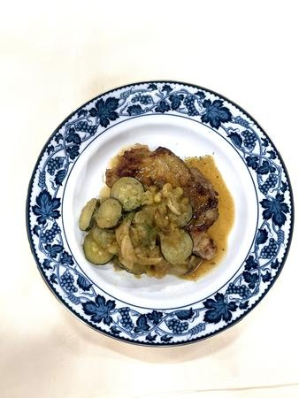

# りんご＆チキンのハニーハーブソテー

> 鶏もも肉をハーブソルトで香ばしく焼き、りんごやズッキーニとともにマスタードとはちみつの甘酸っぱい特製ソースで煮込んだ本格メインディッシュ。

- **カテゴリ**: 主菜・肉料理
- **レシピ考案・出典**: 長野県立大学 健康発達学部 食健康学科（長野県立大学＆飯綱町 受託研究完了報告書）
- **分量**: 2人分
- **調理時間**: 約40分

## 材料

- **鶏肉（もも）**: 1枚
- **りんご**: 1個
- **ズッキーニ**: 1/2本
- **エリンギ**: 1個
- **サラダ油**: 適量
- **小麦粉**: 適量
- **ハーブソルト**: 少々
- **バター**: 15g
- **水**: 250ml
- **コンソメ**: 1個
- **カレー粉**: 少々
- **マスタード**: 大さじ1
- **はちみつ**: 10g

## 作り方

1. 鶏肉を開いて包丁の反対側でたたく。
2. ハーブソルトをすり込み、小麦粉を振っておく。
3. りんごはくし形に切り、皮・芯を除きイチョウ切りにする。ズッキーニ・エリンギは輪切りにする。
4. 油を引いて温めたフライパンで鶏肉の表面を焼き、両面に火が通ったら取り出す。
5. そのままのフライパンにバターを溶かす。
6. 野菜とりんごを入れて焼く。
7. 水、コンソメ、カレー粉、マスタード、はちみつを加えて煮詰める。
8. 鶏肉を戻し入れ、鶏肉に火が通るまで煮込む。
