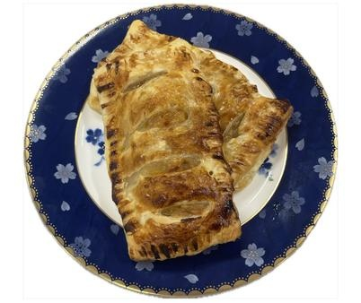

# アップルグラタンパイ

> りんごの自然な甘みとベーコンの塩気、濃厚なチーズとホワイトソースをサクサクのパイシートで包み焼き上げた、食卓が華やぐグラタンパイ。

- **カテゴリ**: 主菜・ベーキング
- **レシピ考案・出典**: 長野県立大学 健康発達学部 食健康学科（長野県立大学＆飯綱町 受託研究完了報告書）
- **分量**: 4人分
- **調理時間**: 約40分

## 材料

- **りんご**: 1個
- **ベーコン**: 50g
- **バター**: 大さじ1
- **小麦粉**: 20g
- **牛乳**: 200g
- **ピザ用チーズ**: 30g
- **はちみつ**: 30g
- **コンソメ**: 小さじ1
- **冷凍パイシート**: 4枚
- **卵液（卵黄1個・みりん大さじ1）**: 適量

## 作り方

1. りんごをくし型に切り芯を除き、皮付きのままいちょう切りにする。ベーコンは2cm幅に切る。
2. 鍋にバターを溶かし、りんごとベーコンを加えて炒める。
3. 具材に火が通ったら小麦粉を振り入れて炒める。
4. 牛乳を数回に分けて加える。
5. 沸騰してきたらコンソメとチーズを加えて、とろみが付くまで混ぜる。
6. オーブンを200℃に予熱する。
7. パイシート1枚を4等分にする。
8. 半分にフォークで穴をあけておく。
9. 具をパイで包み、成形し、卵液をはけで表面に塗った後、オーブンで15～20分焼く。
