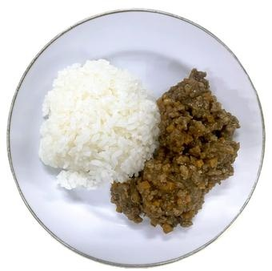

# アップルキーマカレー

> 角切りにしたりんごのシャキッとした食感とフルーティーな甘みが、スパイシーなひき肉の旨みと絶妙にマッチする時短キーマカレー。

- **カテゴリ**: 主食・カレー
- **レシピ考案・出典**: 長野県立大学 健康発達学部 食健康学科（長野県立大学＆飯綱町 受託研究完了報告書）
- **分量**: 2～3人分
- **調理時間**: 約30分

## 材料

- **カレールウ**: 1/2箱
- **豚ひき肉**: 300g
- **玉ねぎ**: 中1個
- **人参**: 中1本
- **りんご**: 小1個
- **サラダ油**: 大さじ1
- **水**: 300ml

## 作り方

1. 玉ねぎ、人参をみじん切りにする。
2. りんごは皮をむいて芯を除き、1cm角に切る。
3. フライパンにサラダ油を熱し、①の玉ねぎ、人参をよく炒める。
4. ひき肉を加え、肉の色が変わるまでよく炒める。
5. 水を加え、沸騰したらあくを取り、ふたをして弱火～中火で約5分煮込む。
6. いったん火を止め、具を端に寄せて空いたところにルウを入れて溶かし、②のりんごを加え、再び弱火で時々かき混ぜながら約5分煮込む。
