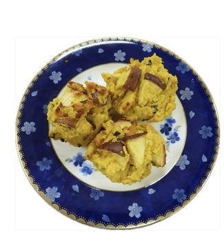

# りんご＆かぼちゃおからのケーキ

> おからと米粉を使い、かぼちゃのホクホク感とりんごの爽やかな酸味を生かしたヘルシーで優しい甘さのマフィン風ケーキ。

- **カテゴリ**: スイーツ・おやつ
- **レシピ考案・出典**: 長野県立大学 健康発達学部 食健康学科（長野県立大学＆飯綱町 受託研究完了報告書）
- **分量**: 紙カップ 10個分
- **調理時間**: 約40分

## 材料

- **りんご**: 1個
- **サラダ油**: 40g
- **牛乳**: 50g
- **かぼちゃ（マッシュ状態で）**: 200g
- **砂糖**: 50g
- **米粉**: 100g
- **レモン汁**: 10g
- **おから**: 150g
- **サラダ油（型に塗る分）**: 適量

## 作り方

1. りんごをよく洗って、皮付きでしんを除き、いちょう切りなど好みの大きさ・厚さに切る（皮は好みで除いてもよい）。
2. おからとりんご以外の材料をボウルに入れ、よく混ぜ合わせる。
3. オーブンを190℃に予熱する。
4. ②におからと①のりんごを混ぜ合わせ、紙カップに入れる（アルミ等の金属型を利用する場合は、サラダ油を型に予め塗って入れる）。
5. 190℃のオーブンで20分焼く。
