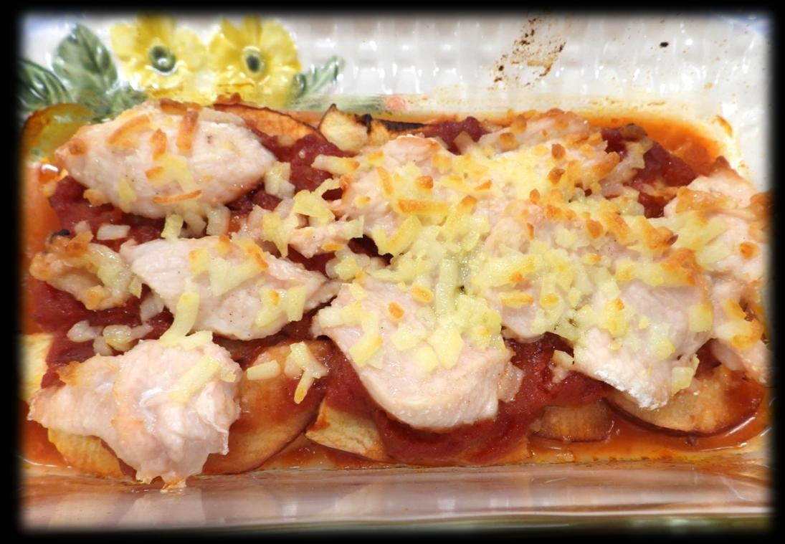

# りんご＆チキンのミルフィーユ焼き 〜トマトソースver.〜

> 薄切りの鶏むね肉とりんごをトマトソース・チーズとともにミルフィーユ状に重ねて焼き上げた、ジューシーで旨みたっぷりのオーブンディッシュ。

- **カテゴリ**: 主菜・オーブン料理
- **レシピ考案・出典**: 長野県立大学 健康発達学部 食健康学科（長野県立大学＆飯綱町 受託研究完了報告書）
- **分量**: 2～3人分
- **調理時間**: 約45分

## 材料

- **鶏胸肉**: 160g
- **薄力粉**: 適量
- **塩・コショウ**: 少々
- **りんご**: 1個
- **●カットトマト缶**: 200g
- **●コンソメ**: 1/2個
- **●砂糖**: 小さじ1
- **●おろしにんにく**: 1cm
- **●オリーブオイル**: 小さじ1
- **オリーブオイル**: 適量
- **ピザ用チーズ**: 30g

## 作り方

1. オーブンを200℃に予熱する。
2. 鶏肉をそぎ切りにし、薄力粉と塩・コショウを両面にまぶす。
3. りんごはくし形に切って芯を除き、皮付きで薄切りにする。
4. ●を小鍋に入れ、混ぜながら5分ほど煮詰めて特製トマトソースを作る。
5. グラタン皿にオリーブオイルを塗り、りんご → ソース → 鶏肉 → チーズの順で重ねる。
6. アルミホイルを被せ、200℃のオーブンで35分焼く（焦げ目をつけるため、焼き始め20分後にアルミホイルを外す）。
