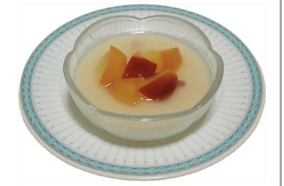

# りんご＆ヨーグルトゼリー

> 電子レンジで簡単につくる淡いピンク色のりんごコンポートと、爽やかなヨーグルトゼリーを合わせた清涼感あふれるデザート。

- **カテゴリ**: スイーツ・冷菓
- **レシピ考案・出典**: 長野県立大学 健康発達学部 食健康学科（長野県立大学＆飯綱町 受託研究完了報告書）
- **分量**: 2～3人分
- **調理時間**: 約20分（冷やし固める時間を除く）

## 材料

- **りんご**: 1個
- **水**: 25ml
- **砂糖**: 20g
- **レモン汁**: 大さじ1
- **プレーンヨーグルト**: 120g
- **牛乳**: 80ml
- **砂糖**: 20g
- **粉ゼラチン**: 5g
- **水（ゼラチン用）**: 60ml

## 作り方

1. りんごをよく洗って、くし形に切り、芯を除き、小さめの一口大に切る（皮付きだとほんのりピンク色のコンポートになる）。
2. 耐熱皿かレンジ対応ボウルにりんご、水25ml、砂糖20g、レモン汁を入れ、軽くかき混ぜる。
3. ラップをかけて、電子レンジ600Wで3分半（500Wで4分）加熱する。
4. 水60mlに粉ゼラチンを振り入れ、かき混ぜて10分ほどおいてふやかす。
5. 小鍋に牛乳、砂糖20g、ふやかしたゼラチンを入れて火にかけ、沸騰させないように弱火で煮溶かす。
6. 溶けたら火からおろし、ヨーグルトを加えて混ぜ、③のりんご（一部は飾り用に残す）を加え混ぜ、器に入れて冷蔵庫で冷やし固める。
7. 冷え固まったゼリーの上に、飾り用のりんごと汁を好みの量トッピングする。
