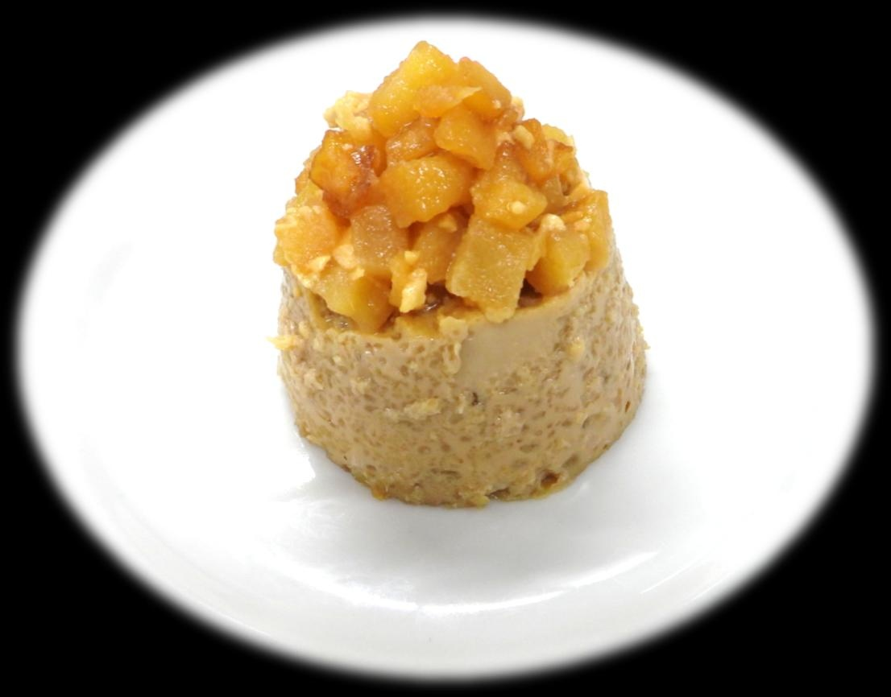

# りんご紅茶プリン

> アールグレイの芳醇な香りのなめらかプリンの底に、バターでじっくりソテーしたりんごを忍ばせた、ちょっとリッチな大人のスイーツ。

- **カテゴリ**: スイーツ・プリン
- **レシピ考案・出典**: 長野県立大学 健康発達学部 食健康学科（長野県立大学＆飯綱町 受託研究完了報告書）
- **分量**: 3～4個分
- **調理時間**: 約60分

## 材料

- **卵**: 2個
- **砂糖**: 40g
- **水**: 50ml
- **牛乳**: 200ml
- **アールグレイ茶葉**: 4g（またはティーバッグ1袋）
- **りんご**: 1/2個
- **砂糖（りんご用）**: 大さじ1
- **バター**: 10g

## 作り方

1. ボウルに卵と砂糖を入れ、すり混ぜる。
2. 鍋に水を入れ沸騰したら茶葉を加えて弱火で3分ほど加熱して濃いめに抽出する。十分に香りと色が出たら茶こしで濾す。牛乳を加えて混ぜた後、①の卵液と混ぜ合わせる。
3. りんごは皮と芯を除き、サイコロ状に切る。
4. フライパンにバターを中火で熱し、りんごを加え2～3分混ぜながら加熱する。
5. 砂糖を加え、さらに5分ほど加熱する。プリン型の下に敷き詰める（トッピング用に少し残しておく）。
6. ②のプリン液を茶漉しで濾しながら、りんごを敷いた型に注ぎ入れる。
7. オーブンの天板にプリン型を並べ、お湯を張り、150℃のオーブンで30～40分湯せん焼きにする。
8. 型から外し、残しておいたりんごをトップに飾る。
