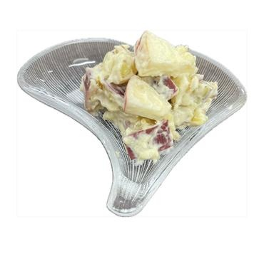

# アップル＆スイートポテトサラダ

> ほくほくの温かいさつまいもにクリームチーズを絡め、みずみずしいりんごと香ばしいナッツを合わせた、デリ風の極上ごちそうサラダ。

- **カテゴリ**: 副菜・サラダ
- **レシピ考案・出典**: 長野県立大学 健康発達学部 食健康学科（長野県立大学＆飯綱町 受託研究完了報告書）
- **分量**: 2～3人分
- **調理時間**: 約20分

## 材料

- **さつまいも**: 中1本
- **ミックスナッツ**: 25g
- **りんご**: 1個
- **クリームチーズ**: 50g
- **マヨネーズ**: 大さじ1/2

## 作り方

1. ミックスナッツを粗く刻む。
2. さつまいもをよく洗い、皮ごと2cm角に切り、水にさらしてアクを抜く。
3. さつまいもを水からあげ、鍋で竹串がスッと通るまでゆでる。
4. りんごを縦に8等分し、芯をとった後5mm幅の薄切りにする。
5. さつまいもが熱いうちにクリームチーズを加えて余熱で溶かしながら混ぜ合わせる。
6. ⑤に④のりんご、①のナッツ、マヨネーズを加えて全体をさっくり和える。
