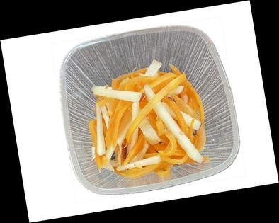

# りんごと人参サラダ

> 千切り人参の鮮やかなオレンジとりんごのシャキシャキ食感。特製ビネガードレッシングとナッツのアクセントが効いたキャロットラペ風サラダ。

- **カテゴリ**: 副菜・サラダ
- **レシピ考案・出典**: 長野県立大学 健康発達学部 食健康学科（長野県立大学＆飯綱町 受託研究完了報告書）
- **分量**: 2～3人分
- **調理時間**: 約20分

## 材料

- **人参**: 中1本
- **りんご**: 小1個
- **ミックスナッツ**: 25g
- **レモン汁**: 小さじ1
- **塩**: 小さじ1/2
- **オリーブオイル**: 大さじ1
- **酢**: 小さじ1
- **砂糖**: 小さじ1/2

## 作り方

1. ミックスナッツを粗く刻む。
2. 人参を千切りにして塩もみし、5分ほど置いてしんなりさせる。
3. りんごを千切りにし、色止めにレモン汁を回しかけておく。
4. 人参の水気をしっかり絞り、③のりんごと合わせる。
5. オリーブオイル、酢、砂糖をよく混ぜ合わせてドレッシングを作り、④に加えて和える。
