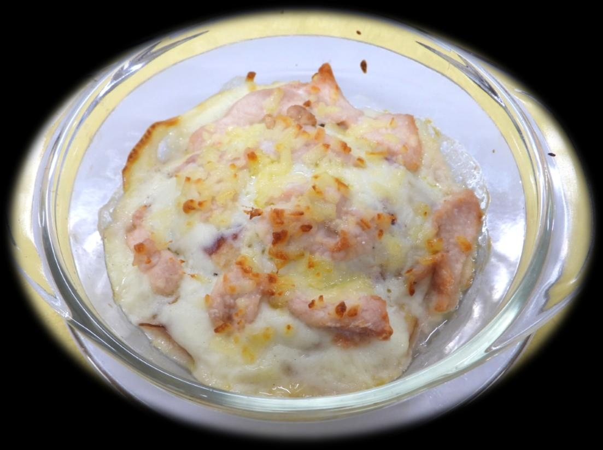

# りんごとチキンのミルフィーユ焼き 〜ホワイトソースver.〜

> 手作りの濃厚なホワイトソースととろけるチーズ、りんごの優しい甘みと柔らかな鶏肉が重なり合う、冬の食卓にぴったりなごちそうグラタン風。

- **カテゴリ**: 主菜・オーブン料理
- **レシピ考案・出典**: 長野県立大学 健康発達学部 食健康学科（長野県立大学＆飯綱町 受託研究完了報告書）
- **分量**: 2～3人分
- **調理時間**: 約45分

## 材料

- **鶏胸肉**: 160g
- **薄力粉**: 適量
- **塩・コショウ**: 少々
- **りんご**: 1/2個
- **●有塩バター**: 20g
- **●薄力粉**: 20g
- **●牛乳**: 200ml
- **●塩・コショウ**: 少々
- **オリーブオイル**: 適量
- **ピザ用チーズ**: 30g

## 作り方

1. オーブンを200℃に予熱する。
2. 鶏肉をそぎ切りにし、薄力粉と塩・コショウを両面に薄くまぶす。
3. りんごはくし形に切って芯を除き、皮付きで薄切りにする。
4. 小鍋にバターを溶かし薄力粉を炒め、牛乳を少しずつ加えてダマにならないように混ぜながらホワイトソースを作る。
5. グラタン皿にオリーブオイルを塗り、りんご → ホワイトソース → 鶏肉 → チーズの順で重ねる。
6. アルミホイルを被せ、200℃のオーブンで35分焼く（焼き始め20分後にアルミホイルを外し、表面にきれいな焼き色をつける）。
