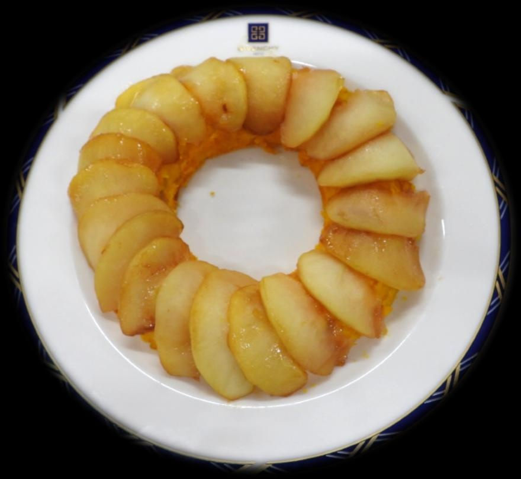

# りんご&かぼちゃのしっとりケーキ

> たっぷりの裏ごしかぼちゃと生クリームを贅沢に使ったしっとり生地に、香ばしくキャラメリゼしたりんごを美しくトッピングした本格ケーキ。

- **カテゴリ**: スイーツ・焼き菓子
- **レシピ考案・出典**: 長野県立大学 健康発達学部 食健康学科（長野県立大学＆飯綱町 受託研究完了報告書）
- **分量**: 型1個分
- **調理時間**: 約50分

## 材料

- **かぼちゃ**: 400～500g
- **りんご（生地用）**: 1/2個
- **●砂糖**: 60g
- **●卵**: 2個
- **●生クリーム**: 200ml
- **●薄力粉**: 30g
- **【キャラメリゼ用】りんご**: 1個
- **【キャラメリゼ用】バター**: 20g
- **【キャラメリゼ用】砂糖**: 大さじ2

## 作り方

1. オーブンを170℃に予熱する。
2. かぼちゃの皮と種とワタを取り除き、一口大に切って柔らかくなるまでゆでて裏ごす。
3. りんごをくし形に切って皮と芯を除き、キャラメリゼ用1個分は薄切り、生地用1/2個分はいちょう切りにする。
4. ②のかぼちゃに●を入れてよく混ぜ、混ざったらいちょう切りのりんごを加えて混ぜ合わせる。
5. ケーキ型にクッキングシートを敷き、生地を流し入れて170℃のオーブンで30分焼く。
6. 焼いている間に、フライパンにバターを中火で熱し、薄切りにしたりんごを2～3分炒める。
7. ⑥に砂糖を加え、木べらで混ぜながらさらに5分ほど加熱し、ツヤよくキャラメリゼする。
8. ⑤のケーキが焼き上がったら粗熱を取り、型から外してキャラメリゼしたりんごを表面に美しく飾り付ける。
