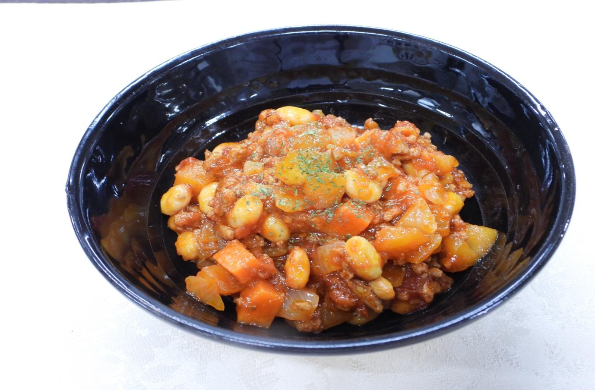

# アップルチリコンカン

> ひき肉と大豆、トマトを煮込んだスパイシーなチリコンカンに、角切りりんごの甘みと酸味が加わることで、味に驚きの深みとコクが生まれます。

- **カテゴリ**: 主菜・煮込み
- **レシピ考案・出典**: 長野県立大学 健康発達学部 食健康学科（長野県立大学＆飯綱町 受託研究完了報告書）
- **分量**: 1人分
- **調理時間**: 約30分

## 材料

- **合いびき肉**: 150g
- **ゆで大豆**: 150g
- **りんご**: 小1個
- **玉ねぎ**: 小1個
- **人参**: 45g
- **おろしにんにく**: 適量
- **チリパウダー**: 少々
- **カットトマト缶**: 300g
- **水**: 75ml
- **コンソメ**: 1個
- **ケチャップ**: 大さじ1
- **塩・コショウ**: 適量
- **サラダ油**: 大さじ1
- **はちみつ**: 大さじ1
- **ウスターソース**: 大さじ1
- **ローリエ**: 1枚
- **パセリ（乾燥）**: 少々

## 作り方

1. 人参、玉ねぎ、芯を除いたりんごをサイコロ型に切る。
2. 人参を水からゆでて火を通しておく。
3. 鍋にサラダ油とおろしにんにくを熱し、合いびき肉、ゆでた人参、玉ねぎを加えて中火で炒める。
4. チリパウダーを加え、香りが立つまでさらに炒め合わせる。
5. カットトマト缶、水、コンソメ、ケチャップ、ゆで大豆、ローリエを加え、蓋を少しずらして弱火～中火で8分ほど煮込む。
6. 角切りりんごを加えて蓋を取り、とろみがつく程度まで煮詰めて余分な水分をとばす。
7. 塩・コショウ、はちみつ、ウスターソースを加えて味をととのえる。
8. 器に盛り付け、仕上げに乾燥パセリを振りかける。
