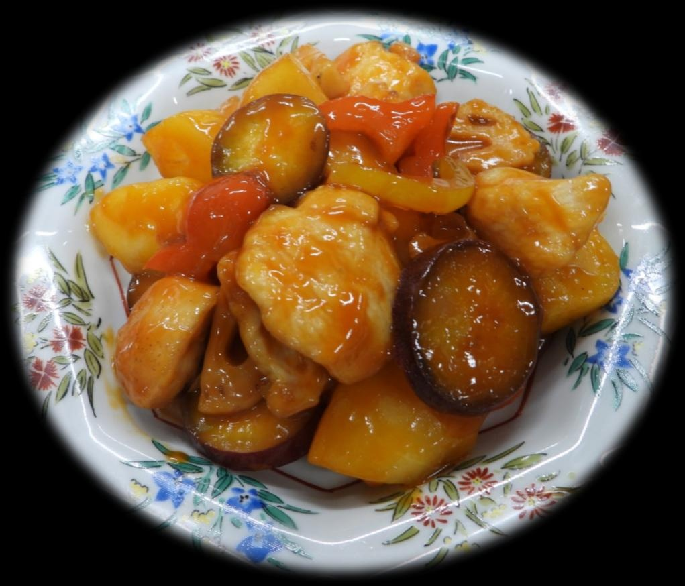

# りんご&鶏肉の甘酢炒め

> ジューシーな鶏肉に、りんご、さつまいも、れんこんなどの根菜がごろごろ入った彩り豊かな一皿。特製甘酢あんと絡んでご飯が進む絶品おかず。

- **カテゴリ**: 主菜・炒め物
- **レシピ考案・出典**: 長野県立大学 健康発達学部 食健康学科（長野県立大学＆飯綱町 受託研究完了報告書）
- **分量**: 2人分
- **調理時間**: 約40分

## 材料

- **鶏むね肉**: 140g
- **りんご**: 小1個
- **さつまいも**: 1/2個
- **れんこん**: 80g
- **パプリカ（赤）**: 70g
- **塩・コショウ**: 適量
- **片栗粉（まぶし用）**: 大さじ1
- **サラダ油**: 適量
- **●酢**: 大さじ1と1/2
- **●ケチャップ**: 大さじ1と1/2
- **●砂糖**: 大さじ1と1/2
- **●醤油**: 大さじ1と1/3
- **●塩**: ひとつまみ
- **●片栗粉**: 大さじ1/2
- **●水**: 100ml

## 作り方

1. 鶏むね肉を一口大のそぎ切りにし、塩・コショウと片栗粉を全体にまぶす。
2. りんごは皮をむき芯を除いて一口大、さつまいもは輪切り、れんこんは皮をむいていちょう切り、パプリカは小さめの一口大に切る。
3. りんご、さつまいも、れんこんをそれぞれ耐熱容器に入れてラップをし、電子レンジ600Wで100g当たり1分を目安に下加熱する。
4. ●の調味料（酢、ケチャップ、砂糖、醤油、塩、片栗粉、水）を小ボウルでよく混ぜ合わせておく。
5. フライパンにサラダ油を熱し、鶏肉を両面こんがりと焼く。
6. 鶏肉に火が通ったらパプリカを加えて軽く炒め合わせる。
7. レンジ加熱したりんご、さつまいも、れんこんと混ぜ合わせておいた甘酢調味液を加え、弱火～中火でとろみがつくまで手早く絡め合わせる。
