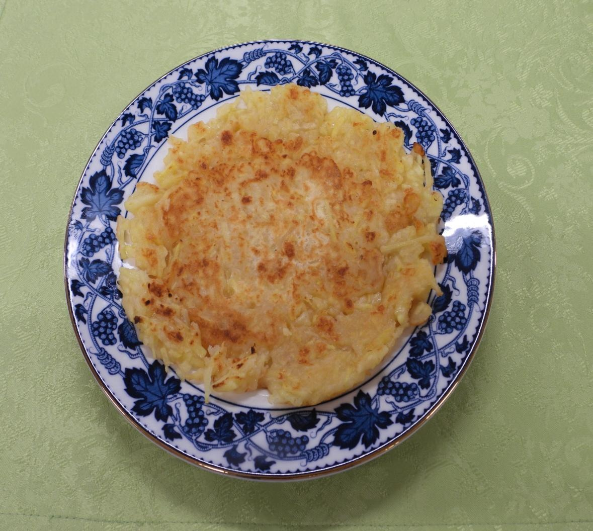

# りんご&生姜のぽかぽかチヂミ

> 千切りりんごとピリッとした生姜、香ばしいチーズをカリッと香ばしく焼き上げた新感覚チヂミ。黒コショウのおつまみ風にも、はちみつスイーツ風にも楽しめます。

- **カテゴリ**: 主食・軽食
- **レシピ考案・出典**: 長野県立大学 健康発達学部 食健康学科（長野県立大学＆飯綱町 受託研究完了報告書）
- **分量**: 3人分（2枚分）
- **調理時間**: 約20分

## 材料

- **りんご（皮・芯を除く）**: 120g
- **生姜**: 20g
- **ピザ用チーズ**: 35g
- **小麦粉**: 45g
- **片栗粉**: 45g
- **水**: 80ml
- **ごま油**: 大さじ1
- **粉チーズ**: 適量
- **黒コショウ**: 適量

## 作り方

1. りんごは皮をむき芯を除き、生姜は皮をむいて、それぞれ千切りにする。
2. ボウルに小麦粉、片栗粉、水を入れて粉っぽさがなくなるまでよく混ぜる。
3. 生地に千切りりんご、生姜、ピザ用チーズを加えてさっくり混ぜ合わせる。
4. フライパンにごま油大さじ1/2を入れて中火で熱し、生地の半量を薄く広げ入れる。3分ほど焼いて香ばしい焼き色がついたら裏返し、もう片面もカリッと焼く。同様に残りの1枚も焼く。
5. 器に盛り付け、お好みで粉チーズと黒コショウを振る。

## 調理のポイント・美味しく作るコツ

- 粉チーズと黒コショウの代わりに、はちみつや粉砂糖をかけると、デザート感覚で味わえます。
