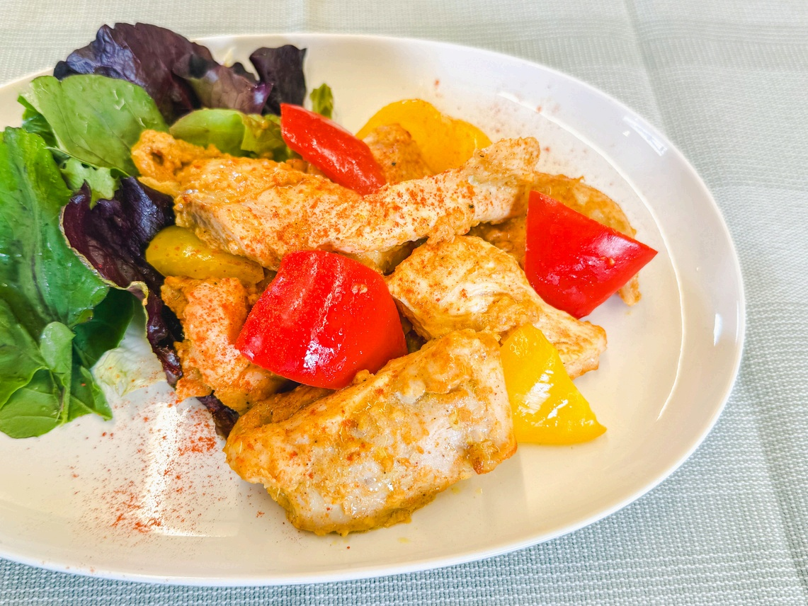

# すりおろしブラムリーでやわらかい 簡単タンドリーチキン

> 飯綱町特産の青りんご「ブラムリー」をすりおろして漬け込むことで、リンゴ酸の力でお肉がしっとり驚くほど柔らかく仕上がる本格タンドリーチキン。

- **カテゴリ**: 主菜・肉料理
- **レシピ考案・出典**: パカーンコーヒースタンド yuka（ブラムリーレシピブック）
- **分量**: 2〜3人分
- **調理時間**: 約40分（漬け込み時間を除く）

## 材料

- **鶏肉（もも、むね肉）**: 約500g
- **塩、コショウ**: ひとつまみ
- **油**: 大さじ1
- **A プレーンヨーグルト**: 大さじ2
- **A トマトケチャップ**: 大さじ1
- **A カレー粉**: 大さじ1
- **A 飯綱産ブラムリー（すりおろし）**: 1/4個
- **A ニンニク（すりおろし）**: 1片
- **A 生姜（すりおろし）**: 5g

## 作り方

1. 鶏肉を大きめの一口サイズに切り、塩コショウをふる。
2. ボウルにAをすべて合わせて混ぜ、鶏肉を入れて揉み込む。油を回し入れよく混ぜて30分程休ませる。
3. フライパンに少量の油（分量外）をひき、皮を下にして鶏肉を並べ、中火で焼く。
4. 香ばしい焼き色がついたら裏返し、蓋をして弱火～中火で5分ほど蒸し焼きにして出来上がり。

## 調理のポイント・美味しく作るコツ

- 最初に鶏肉に塩コショウを振ることで、余分な水分や臭みを取り除きお肉を柔らかくします。
- よりフルーティーな風味にしたい場合は、ブラムリーを1/2個擦りおろしても美味しく仕上がります。
- 擦りおろすことで、豊富なリンゴ酸によりお肉がとても柔らかくなるため、パサつきやすい鶏むね肉でもしっとりジューシーに仕上がります。
