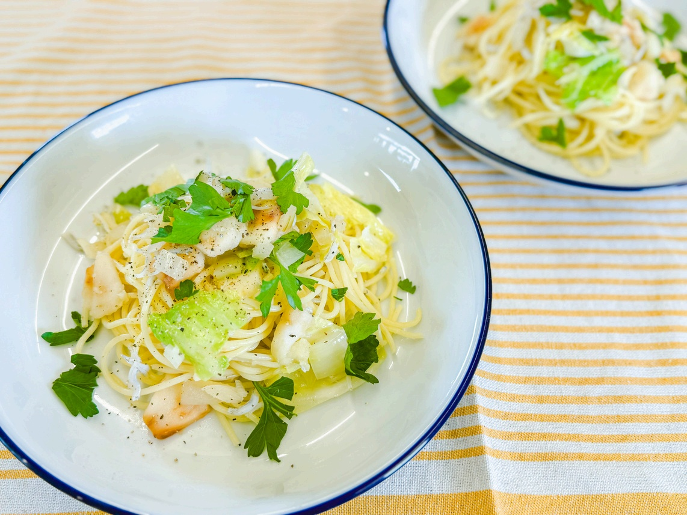

# ブラムリーでさっぱり！ しらすとキャベツのペペロンチーノ

> ブラムリーならではのキュッと爽快な酸味がオリーブオイルやバターのコクとベストマッチ！しらすの旨みとキャベツの甘みが引き立つ絶品オイルパスタ。

- **カテゴリ**: 主食・パスタ
- **レシピ考案・出典**: パカーンコーヒースタンド yuka（ブラムリーレシピブック）
- **分量**: 2人分
- **調理時間**: 約15分

## 材料

- **パスタ**: 200g
- **バター**: 10g
- **玉ねぎ**: 1/2個
- **にんにく**: 1片
- **キャベツ**: 40g
- **しらす**: 60g
- **飯綱産ブラムリー**: 1/2個
- **塩、こしょう**: 少々
- **イタリアンパセリ**: お好みで
- **鷹の爪**: お好みで

## 作り方

1. 鍋にたっぷりのお湯を沸かし、塩（分量外）を加えてパスタを表示時間より少し短めに茹でる。
2. 玉ねぎは1cm角に切る。ブラムリーは皮を剥いてイチョウ切りにし、色止めに塩水につけておく。キャベツはざく切り、にんにくは包丁の背でつぶす。
3. フライパンにバターとにんにくを入れて弱火にかけ、香りが立ったら玉ねぎ、ブラムリー、キャベツを加え、塩こしょう少々を振って炒める。野菜がしんなりしてきたらしらすを加える。
4. パスタの茹で汁大さじ2杯をフライパンに加えてしっかり揺すりながら乳化させ、茹で上がったパスタを加えて手早く絡める。
5. 塩こしょうで味をととのえ、器に盛り付けイタリアンパセリを散らして完成。

## 調理のポイント・美味しく作るコツ

- ブラムリーの爽やかな酸味がアクセントになるレシピです。厚めに切るとよりフレッシュな酸味が楽しめます♪
- 火を入れすぎるとりんごや野菜のシャキッとした食感がなくなるので、手早くサッと火を通すのがコツです。
