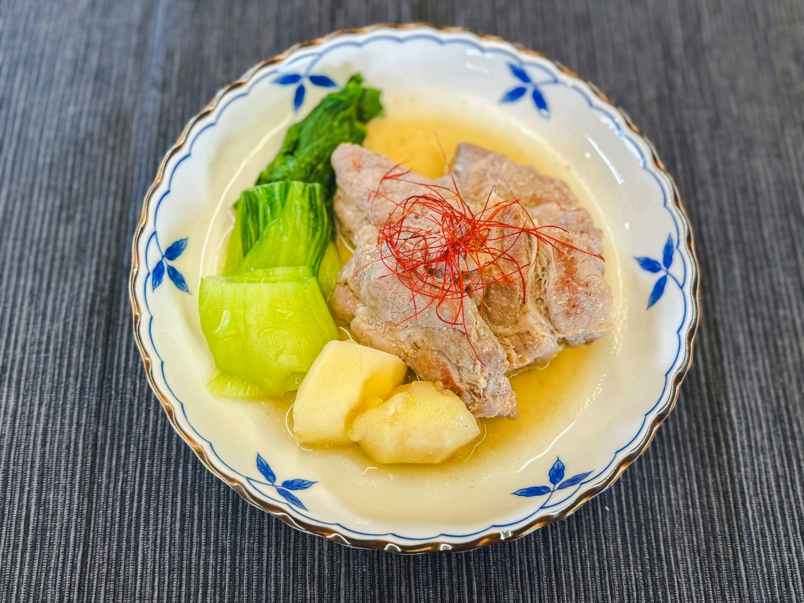

# ブラムリーと一緒に煮込む 白い豚の角煮

> 醤油を使わずに塩麹とブラムリーの酸味で煮込むことで、お肉が驚くほど柔らかく、見た目も美しくさっぱりといただける新感覚の白い豚の角煮。

- **カテゴリ**: 主菜・肉料理
- **レシピ考案・出典**: パカーンコーヒースタンド yuka（ブラムリーレシピブック）
- **分量**: 3〜4人分
- **調理時間**: 約30分（休ませ時間を除く）

## 材料

- **豚塊肉（バラまたはロース）**: 600g
- **塩麹**: 大さじ2
- **酒**: 大さじ2
- **にんにく**: 3片
- **ごま油**: 大さじ1
- **飯綱産ブラムリー**: 1個
- **生姜**: 10g
- **ネギの青い部分**: 適量（お好みで）
- **A 穀物酢**: 大さじ2
- **A 紹興酒（または料理酒）**: 大さじ1
- **A 水**: 200ml
- **A 砂糖**: 大さじ1.5
- **【付け合わせ】青梗菜、白髪ネギ、ゆで卵**: お好みで

## 作り方

1. 豚肉を5mm幅に切り、塩麹と酒を揉み込んで20分ほど室温で休ませる。
2. Aの調味料をボウルに合わせておく。にんにくはつぶし、ブラムリーは皮を剥いてざく切り、生姜は薄くスライスする。
3. フライパンにごま油とにんにくを入れて中火にかける。香りが立ってきたら豚肉を並べ、焦がさないように両面を軽く焼く。
4. 豚肉の両面が白くなったら、Aの合わせ調味料、ブラムリー、生姜、ネギの青い部分を入れ、落とし蓋をしてひと煮立ちさせる。沸騰したら弱火にして15分ほどコトコト煮込む。
5. ブラムリーがスッと箸で切れるくらい柔らかく煮崩れ、豚肉に味が染み込んだら出来上がり。お好みで茹でた青梗菜、白髪ネギ、ゆで卵を添える。

## 調理のポイント・美味しく作るコツ

- 煮込み時間を15分と短めに設定しているため、豚肉とブラムリーの火入れに差が出ないよう、ブラムリーの切り方や大きさを均一に揃えてください。
