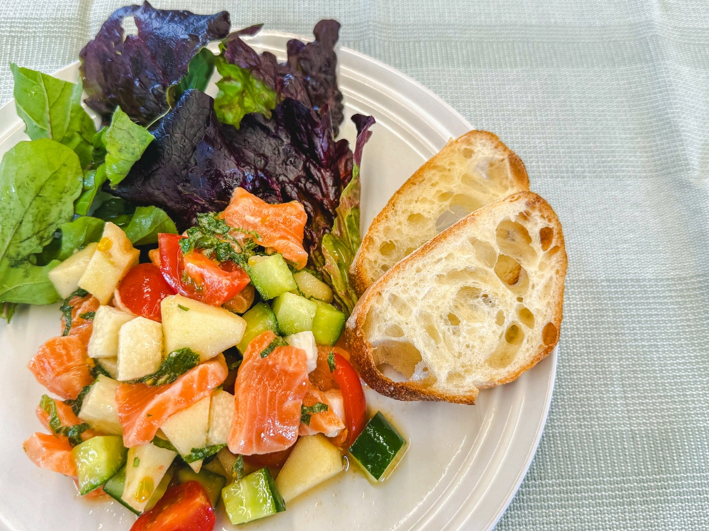

# 生食で食べるブラムリーと！ サーモンのポン酢サラダ

> 調理用りんごとして知られるブラムリーをあえて「生」で！きゅうりや長芋、脂ののったサーモンとポン酢で和えた、夏バテも吹き飛ぶ極上カルパッチョ風サラダ。

- **カテゴリ**: 前菜・サラダ
- **レシピ考案・出典**: パカーンコーヒースタンド yuka（ブラムリーレシピブック）
- **分量**: 2人分
- **調理時間**: 約10分

## 材料

- **サーモン刺身用**: 200g
- **きゅうり**: 1本
- **トマト**: 1/2個
- **長芋**: 100g
- **大葉**: 3枚（お好みの野菜でOK）
- **飯綱産ブラムリー**: 中サイズ1個
- **塩**: ひとつまみ
- **ポン酢**: 大さじ3
- **オリーブオイル**: 大さじ1

## 作り方

1. 野菜（きゅうり、トマト、長芋）はすべて1cm角の大きさに揃えて切る。サーモンも食べやすい一口サイズに切る。
2. ブラムリーは皮を剥いて1cm角に切り、変色を防ぐため塩水（分量外）にサッとくぐらせて水気を切る。
3. ボウルに切った野菜、サーモン、ブラムリーを入れ、塩ひとつまみとポン酢を加えて全体を和える。
4. 器に盛り付け、仕上げに上質なオリーブオイルを回しかけて完成！

## 調理のポイント・美味しく作るコツ

- お好みの季節の野菜で代用可能です。モッツァレラチーズや角切りチーズを加えても濃厚でおいしく仕上がります。
- ブラムリーを一番手軽に「生食」で楽しめるおすすめレシピ。酸味がキリッと効いて、食欲が落ちる夏でもさっぱり食べられます♪
