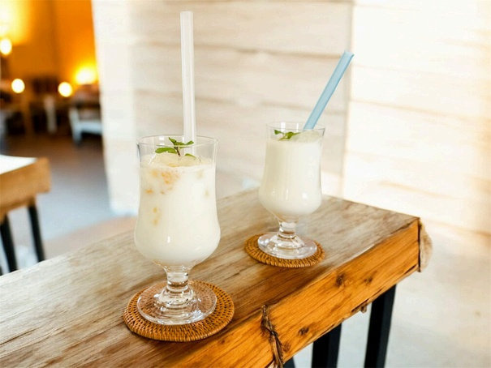

# ブラムリージャムで 本格ラッシー

> 自家製ブラムリージャムとヨーグルトを水で割り、スパイスをきかせた本格インド風ラッシー。サラッとした爽快な飲み心地でカレーや肉料理のお供に最高。

- **カテゴリ**: ドリンク
- **レシピ考案・出典**: パカーンコーヒースタンド yuka（ブラムリーレシピブック）
- **分量**: 1杯分
- **調理時間**: 約3分

## 材料

- **A プレーンヨーグルト**: 50g
- **A 飯綱産ブラムリージャム**: 20g
- **A アガベシロップ（またははちみつ）**: 15g
- **A 塩**: 少々
- **水**: 150ml
- **シナモンパウダー**: 少々（お好みで）
- **カルダモンパウダー**: 少々（お好みで）
- **ブラックペッパー**: 少々（お好みで）

## 作り方

1. ボウルにA（ヨーグルト、ブラムリージャム、アガベシロップ、塩）を入れてスプーンや泡立て器でよく混ぜ合わせる。
2. ①に水を少しずつ注ぎ入れながら泡立て器でしっかり混ぜ、氷を入れたグラスに注ぐ。
3. お好みでシナモン、カルダモン、ブラックペッパー等のスパイスを上からふりかけて出来上がり。

## 調理のポイント・美味しく作るコツ

- 牛乳ではなくお水で割ることで、重たくならずサラッと喉ごしよく飲める本格スタイルのラッシーです。
- 使用するブラムリージャムの糖度に合わせて、アガベシロップの量を調整してください。
- 塩をひとつまみ入れることで、ブラムリーの酸味と甘みの輪郭が際立ち、味に奥深い深みが生まれます。
