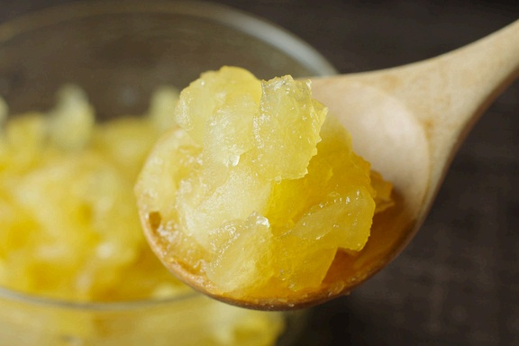

# 電子レンジで簡単！ブラムリージャム ＆ ブラムリーの基礎知識

> 加熱すると一瞬でとろけるブラムリーの特性を活かし、電子レンジわずか6分でできる絶品生ジャム。イギリス生まれの青りんご「ブラムリー」の特徴も詳しく解説。

- **カテゴリ**: 保存食・ジャム＆コラム
- **レシピ考案・出典**: パカーンコーヒースタンド yuka / 飯綱町（ブラムリーレシピブック）
- **分量**: 作りやすい分量（約200g）
- **調理時間**: 約10分

## 材料

- **飯綱産ブラムリー**: 1個（正味200～250g）
- **グラニュー糖**: 60g
- **レモン汁**: 大さじ1

## 作り方

1. ブラムリーは皮をむき、芯を除いて薄切りにする。
2. 耐熱ガラスボウルにブラムリー、グラニュー糖、レモン汁をすべて入れ、軽く全体を混ぜ合わせる。
3. ラップをふんわりとかけ、電子レンジ600Wで約6分加熱する。
4. レンジから取り出し、泡立て器またはスプーンでよく混ぜると、ブラムリーの果肉が自然と崩れて滑らかな黄金色のジャムに仕上がります。

## 調理のポイント・美味しく作るコツ

- 【ブラムリーについて】
- ・収穫期：8月下旬～9月中旬の短い期間のみ収穫される希少な青りんご。
- ・大きさ：1個300g～500gと大玉で、形はやや平たい扁円形。
- ・味わい：生では甘味よりも強烈な酸味と芳醇な香りが際立つクッキングアップルの王様。
- ・特徴：加熱すると短時間で果肉がピュレ状に煮崩れ、熱を加えても爽やかな青りんごのアロマが失われません。新鮮なうちにジャムやパイに加工し、冷凍保存するのもおすすめです。
