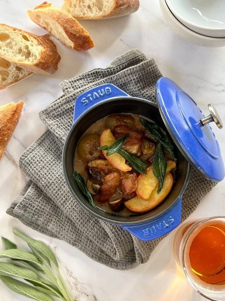

# 秋のキャセロール 豚肉とブラムリーアップルのシードル・セージ風味

> 英国伝統の煮込み料理。豚肉の塊と角切りブラムリーを辛口シードルとフレッシュセージで2時間半じっくり煮込んだ、とろけるような深いコクと芳醇なハーブ香る逸品。

- **カテゴリ**: 主菜・伝統英国料理
- **レシピ考案・出典**: モーニングトン・クレセント：ステイシー・ウォード（ブラムリーレシピブック）
- **分量**: 4人分
- **調理時間**: 約3時間（弱火煮込み含む）

## 材料

- **豚肉塊肉**: 500g
- **塩**: 2g
- **サラダ油**: 大さじ2～3杯
- **パールオニオン（または玉ねぎ・シャロット）**: 200g
- **薄力粉**: 25g
- **ブラウンマッシュルーム**: 110g
- **辛口シードル**: 400g
- **チキンブイヨン**: 300g
- **飯綱産ブラムリー**: 200g程度
- **フレッシュセージ**: 1～2g
- **塩・胡椒**: 適量
- **【オプション】素揚げしたフレッシュセージの葉**: 適宜
- **【オプション】キャラメリゼしたりんごスライス**: 適宜

## 作り方

1. 豚肉は約3cmの角切りにし、塩2gをまぶす。フライパンにサラダ油を入れて中火で温め、豚肉を入れて表面全体にしっかり焼き色をつける。焼き色がついたらボウルに取り出し、薄力粉をまぶす。
2. 同じフライパンでパールオニオン（玉ねぎの場合は大きめのくし形切り）も香ばしい焼き色をつける。
3. フライパンにシードルを少量流し入れ、底にこびりついた肉の旨味（フォンドヴォー）をこそげ落として液体に溶かし込む。
4. 鍋（あれば鋳物ホーロー鍋、または耐熱ガラス・陶器の蓋付きキャセロール鍋）に、豚肉、オニオン、角切りにしたブラムリー、粗く刻んだセージ、シードル、チキンブイヨンをすべて入れ、蓋をして弱火で2時間半じっくり煮込む。
5. ブラウンマッシュルーム（大きいものは半分にカット）を加え、さらに弱火で30分煮込む。
6. ソースを味見してお好みで塩・胡椒で味をととのえ、温めたお皿に盛り付ける。お好みで素揚げしたセージやキャラメリゼしたりんごを添えて華やかに仕上げる。

## 調理のポイント・美味しく作るコツ

- イギリスでは豚肉料理にりんごを合わせるのが伝統的な黄金コンビネーションです。ブラムリーがソースに溶け込み、濃厚なシードルの煮込みに極上の酸味と軽快さを与えます。
