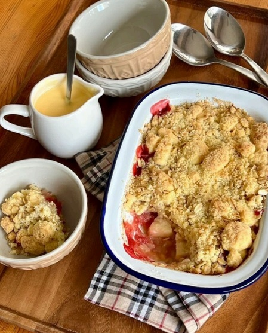

# カスタード添え ブラムリーアップルとブラックベリーのクランブル

> 英国の国民的デザート。酸味あふれるブラムリーフィリングと甘いシナノスイート、ベリーの上に香ばしいオーツクランブルをのせて焼き、手作り温かいカスタードをたっぷり添えて。

- **カテゴリ**: スイーツ・英国伝統菓子
- **レシピ考案・出典**: モーニングトン・クレセント：ステイシー・ウォード（ブラムリーレシピブック）
- **分量**: 4〜6人分
- **調理時間**: 約50分

## 材料

- **【アップルフィリング】飯綱産ブラムリー**: 300g
- **【アップルフィリング】グラニュー糖**: 35g
- **【アップルフィリング】無塩バター**: 10g
- **【アップルフィリング】塩**: ひとつまみ
- **【アップルフィリング】シナモン、砂糖**: 適量
- **【アップルフィリング】シナノスイート**: 80g
- **【アップルフィリング】ブラックベリー**: 40g
- **【クランブル】中力粉（又は強力粉と薄力粉半々）**: 90g
- **【クランブル】無塩バター（冷たいもの）**: 45g
- **【クランブル】グラニュー糖**: 45g
- **【クランブル】ホールオーツ（オートミール）**: 20g
- **【クランブル】塩**: ひとつまみ
- **【カスタードソース】生クリーム**: 120g
- **【カスタードソース】牛乳**: 100g
- **【カスタードソース】卵（Sサイズ）**: 1個（約50g）
- **【カスタードソース】グラニュー糖**: 20g
- **【カスタードソース】コーンスターチ**: 5g
- **【カスタードソース】バニラオイル**: 1g
- **【カスタードソース】塩**: ひとつまみ

## 作り方

1. 皮を剥いて粗く刻んだブラムリー、グラニュー糖、塩、無塩バターを小鍋に入れ、フタをして中火で少し煮崩れるまで加熱する（途中でフタを外して木べらで混ぜ、必要なら水を大さじ1加える）。お好みでシナモンや砂糖を加え味をととのえる。
2. ボウルに小麦粉と塩を入れ、冷たい角切りバターを加え、指先ですり合わせるようにしてサラサラのパン粉〜砂状にする。混ざったらグラニュー糖とホールオーツを加えて軽く混ぜ、クランブル生地を作る。
3. 耐熱焼き型に、①のブラムリーフィリング、生の角切りシナノスイート、ブラックベリーを合わせて敷き詰める。上から②のクランブル生地をふんわりと全体に振りかける。
4. 180℃に予熱したオーブンで約30分焼く。クランブルがきつね色に色づき、フチのフルーツがグツグツと泡立ってきたら焼き上がり。
5. 【特製カスタードを作る】牛乳と生クリームを小鍋に入れ、中火で沸騰直前まで温める。別の耐熱ボウルに卵、グラニュー糖、コーンスターチ、バニラオイル、塩を入れて白っぽくなるまでよくすり混ぜる。
6. 温めたミルク液を卵のボウルに少しずつ混ぜながら注ぎ入れる。全体が混ざったら鍋に戻し、弱めの中火にかけてゴムベラで底を絶えずかき混ぜながらとろみが出るまで加熱する（ダマができたらホイッパーで手早く混ぜて滑らかにする）。
7. 焼き立て熱々のクランブルをお皿に取り分け、温かい特製カスタードソースをたっぷりとかけていただく。

## 調理のポイント・美味しく作るコツ

- 酸味の強いブラムリーに、甘みの強い「シナノスイート」と野性味ある「ブラックベリー」を組み合わせることで、英国菓子ならではの完璧な味のコントラストが生まれます。
